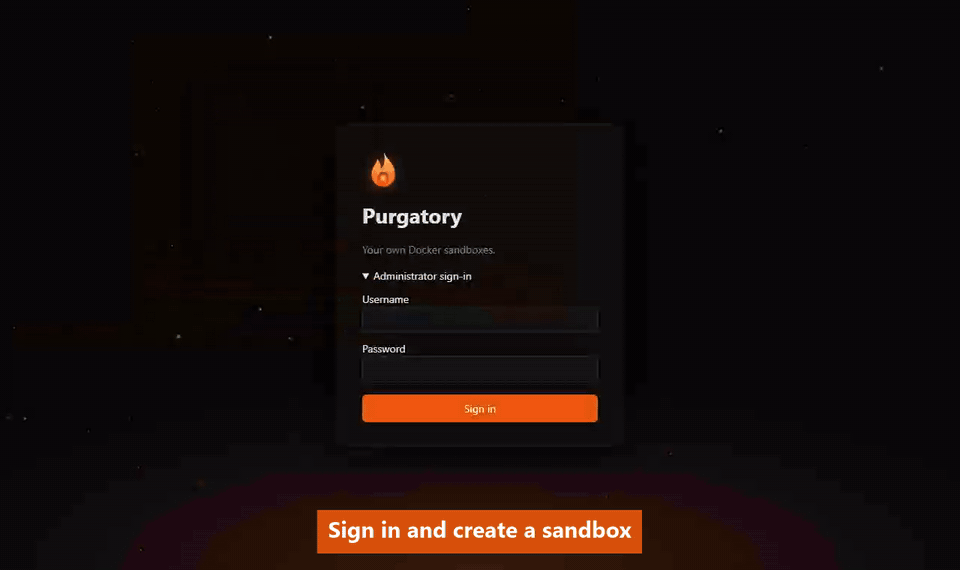

#  Purgatory (p7y)

[](https://github.com/csakaszamok/p7y/actions/workflows/ci.yml) [](LICENSE)

**Self-hosted sandboxes for your team and their AI agents: everyone gets their own Docker, every app gets a URL, idle sandboxes sleep.**



*Where your team's code waits before it goes to heaven (production). Nothing is lost here: idle sandboxes sleep, deleted ones are archived.* `p7y` is the short name, as in k8s: **p**urgator**y**, 7 letters in between. It names the sandboxes (`p7y-<name>`), labels, tokens and the UI address.

**Purgatory gives each user their own Docker daemon on demand** — not a shared platform where you deploy apps, but a full Docker engine they own, with a Portainer UI and a public URL for every app, provisioned in seconds from the web UI or a REST API.

## Who is this for

Teams where people need to spin up arbitrary Docker workloads without touching shared infrastructure. Designed for vibe-coded apps: your colleague runs an AI agent, gets a `docker-compose.yml`, pastes it into Portainer, done.

## What each sandbox gets

- **Its own Docker daemon** (Docker-in-Docker; see [Security](#security) for what that does and does not isolate)
- **Portainer UI** with generated credentials — deploy stacks from a browser
- **Agent access through the Portainer API** — a personal access token is enough for an agent to deploy, build and update ([docs/agent-guide.md](docs/agent-guide.md))
- **FRP tunnel** — public URLs for services running inside the sandbox
- **Sleeps when idle** — after `idle_timeout` without HTTP traffic the sandbox is stopped; the next request wakes it ([Sablier](https://github.com/sablierapp/sablier))
- **Nothing is ever destroyed automatically** — an explicit delete archives the sandbox (config + data) instead of discarding it
- **Template-based** — define what goes into a sandbox via YAML

## Let your agent deploy

Give a coding agent (Claude Code, Codex, Cursor…) a personal access token and a sandbox, and it can ship your app there on its own: wake the sandbox, deploy a compose stack through the sandbox's Portainer API, build images inside it, read the logs and roll out new versions. The app gets its public URL from the tunnel.

1. In the UI: create a sandbox (say `shop`), then in its panel's **Access** tab **Token for this sandbox…** — a token that works only for that sandbox.
2. **Download p7y.env** in the token's dialog and save it in your project folder (keep it out of git), then tell the agent: *Deploy this app to my Purgatory sandbox — settings in p7y.env.* The file holds `P7Y_URL`, `P7Y_TOKEN`, `P7Y_SANDBOX` and `P7Y_AGENT_GUIDE`. Or tell the agent everything yourself, for example:

   > Deploy this repo to my Purgatory sandbox `p7y-shop` at `https://p7y.example.com` with the token `p7y_…`. Follow https://github.com/csakaszamok/p7y/blob/main/docs/agent-guide.md.

[docs/agent-guide.md](docs/agent-guide.md) is written for the agent: every call it needs, tried against a live Purgatory. A token limited to one sandbox keeps the agent away from your other sandboxes; a token for all your sandboxes (Access tokens → + New token) acts as you.

An agent with MCP can also use Purgatory as an MCP server with the same token: see [MCP](#mcp).

## Why Purgatory

A self-hosted Vercel or Railway for the whole team: everyone gets their own Docker, every app a URL, and idle apps cost nothing.

| | Purgatory | Cloud PaaS (Vercel, Railway, Render, Fly.io) | Shared VPS / Coolify / Dokploy |
|---|---|---|---|
| Runs on | your own server, one `docker compose` | their cloud | your own server |
| You pay for | the server | every project and its usage | the server |
| Each person gets | their own Docker daemon, any compose stack | projects on a team account | projects on a shared daemon |
| Public URL for every app | automatic | automatic | Coolify / Dokploy: automatic |
| Idle | sleeps, wakes on the next request | runs and is billed, or scales to zero on some | keeps running |
| On delete | archives | deletes | deletes |

In short: pick Purgatory for the many apps a team builds before production (experiments, demos, internal tools, vibe-coded apps), on your own hardware. For production that must scale, pick a cloud PaaS or Coolify / Dokploy; for untrusted code, a microVM. Coder or Codespaces are for writing code, E2B or Daytona for an agent's short runs: different jobs. The full comparison: [docs/comparison.md](docs/comparison.md).

## Quick start

```bash
# Create a sandbox
curl -X POST http://localhost:8081/sandboxes \
  -H "Authorization: Bearer $TOKEN" \
  -H 'Content-Type: application/json' \
  -d '{"name": "alice", "idle_timeout": "30m"}'

# Response (abridged)
{
  "name": "p7y-alice",
  "tunnel_urls": ["alice-inner-http-echo-port5678.lvh.me", "..."],
  "registry_url": "registry.lvh.me",
  "registry_username": "alice",
  "registry_password": "...",
  "extras": {
    "portainer_url": "http://alice-portainer.lvh.me",
    "portainer_password": "..."
  }
}
```

Sign in at `http://p7y.<HOST_DOMAIN>` to create sandboxes in the browser or mint a personal access token for your agents.

## Running

First check the machine — without cloning anything; it changes nothing (give it the `HOST_DOMAIN` you plan to use):

```bash
curl -fsSL https://raw.githubusercontent.com/csakaszamok/p7y/main/check-host.sh | bash -s -- dev.example.com
```

Or download it, read it, then run it:

```bash
curl -fsSLO https://raw.githubusercontent.com/csakaszamok/p7y/main/check-host.sh
less check-host.sh
bash check-host.sh dev.example.com
```

Then, on a Linux host with Docker Engine and the compose plugin:

```bash
git clone https://github.com/csakaszamok/p7y.git && cd p7y
./setup.sh            # creates .env with random ADMIN_TOKEN, SESSION_SECRET and ADMIN_PASSWORD
docker compose up -d
```

`check-host.sh` (also in the checkout: `./check-host.sh dev.example.com`) checks Docker, sysbox, the address pools, ports, disk and registry access, and changes nothing (its sysbox check runs one throw-away `alpine` container); with the `HOST_DOMAIN` you plan to use it also checks the DNS records and, if `certs/` has one, the certificate. Lines marked ✘ must be fixed first, ⚠ are worth reading.

`setup.sh` prints the admin password and token. It keeps values you already set, so it is safe to run again. Without it: `cp .env.example .env` and set those three by hand.

`docker compose up -d` pulls the released image `ghcr.io/csakaszamok/p7y` (`P7Y_VERSION` in `.env` picks another version); `docker compose up -d --build` builds it from the checkout instead. To work on the code, see [CONTRIBUTING.md](CONTRIBUTING.md).

The stack runs Traefik v3.6 with the Sablier plugin, Sablier, a registry and the Purgatory API. The UI is at `http://p7y.<HOST_DOMAIN>` (by default `http://p7y.lvh.me`, which resolves to `127.0.0.1`), the API also on port `8081` of the host.

Main settings in `.env`:

| Variable | Default | Description |
|---|---|---|
| `ADMIN_TOKEN` | `abc123` (dev only) | Bearer token with admin rights on the API |
| `ADMIN_USER`, `ADMIN_PASSWORD` | `admin`, — | The local admin account of the UI |
| `SESSION_SECRET` | — | Signs the session cookie; a long random string |
| `HOST_DOMAIN` | `lvh.me` | Every address is under it: the UI, the registry, the sandbox apps (needs a wildcard DNS record) |
| `HOST_ADDRESS` | `localhost` | The host's address, put into the sandbox TLS certificates and used for the registry token URL when `PUBLIC_URL` is not set |
| `PUBLIC_URL` | `http://p7y.<HOST_DOMAIN>` | The address of the UI as users see it; `https://…` turns on the HTTPS checks (see [HTTPS](#https)) |
| `OIDC_ISSUER`, `OIDC_CLIENT_ID`, `OIDC_CLIENT_SECRET`, `OIDC_PROVIDER_NAME` | — | Sign-in for everyone but the admin (see [Web UI and sign-in](#web-ui-and-sign-in)) |
| `SANDBOX_QUOTA` | `3` | Sandboxes a user may have running at once; asleep and deep-sleeping ones are not counted; `0` = unlimited |
| `SANDBOX_MAX_TOTAL` | `200` | Users' running and asleep sandboxes on the whole server (each holds a Docker network and its subnet); the admin's are not counted and the admin is not limited; `0` = no limit |
| `DEFAULT_RUNTIME` | `auto` | Runtime for new sandboxes when a request names none: `auto` picks `sysbox` where the host has sysbox installed (no privileged container) and `dind` otherwise; or name one (see [Runtimes and templates](#runtimes-and-templates)) |
| `ALLOWED_RUNTIMES` | — (all) | Runtimes new sandboxes may use, as a comma list: `sysbox` forbids the privileged `dind` on a shared server. Others are left out of `GET /runtimes` and the **New sandbox** form, and a create asking for one is a 400 (so is one without a runtime when the default is not allowed). Existing sandboxes keep running, sleeping and waking |
| `SANDBOX_CPUS`, `SANDBOX_MEMORY` | `2`, `4g` | CPU and memory limit of every new sandbox (see [CPU and memory](#cpu-and-memory)) |
| `SANDBOX_MAX_CPUS`, `SANDBOX_MAX_MEMORY` | `4`, `8g` | How far a user can raise their sandbox's limits; the admin can go up to the host |
| `SANDBOX_DISK` | `20g` | Disk use above which a sandbox is flagged; a warning only, see [Disk](#disk) |
| `GITHUB_STATS` | `on` | The topbar links to the GitHub repo and shows Purgatory's version, stars and forks. The server fetches the counts at most once an hour (users' browsers never contact GitHub); `off` never asks GitHub, and the link and the version stay |
| `DEFAULT_TEMPLATE` | `starter` | Template for new sandboxes when a request names none. An old value such as `dind-standard` makes every create without a template fail with `Unknown template` |
| `DEEP_SLEEP_CHECK_INTERVAL` | `1m` | How often Purgatory looks for sandboxes to take into deep sleep |
| `HOST_SANDBOXES_DIR` | auto-detected | Host path of `opt/sandboxes` (every sandbox's compose file mounts from it). Set it only if auto-detection fails; an old `HOST_USERS_DIR` (the former `opt/users`) still works, its sibling `sandboxes` is used |
| `P7Y_API_BIND` | `0.0.0.0` | Interface of the direct API port `8081`; `127.0.0.1` for a public deployment |
| `REGISTRY_PUBLIC_PULL` | `true` | Images whose versions all passed the secret scan can be pulled without a login; `false`: tokens only |

Each sandbox's files (compose file, certificates, tunnel config) live in `opt/sandboxes/<owner>/<name>/`, its archives in `opt/archive/<owner>/`; `<owner>` is `admin` or the user's sign-in e-mail. Sandboxes from older versions (`opt/users/<name>/`) are moved there at startup; a running one restarts once.

> **Give the Docker daemon a larger address pool.** Every sandbox — sleeping ones included — keeps its own compose network until it is archived. Docker's default pools only allow about 30 networks; beyond that sandbox creation fails with `fully subnetted`. Set smaller subnets in the daemon config (`/etc/docker/daemon.json`, or Docker Desktop → Settings → Docker Engine) and restart Docker:
>
> ```json
> { "default-address-pools": [ { "base": "10.10.0.0/16", "size": 28 } ] }
> ```
>
> A sandbox network needs only a handful of addresses, so `/28` subnets are enough: this allows 4096 networks (`/24` would allow 256).

> **Before exposing Purgatory publicly**, set `ADMIN_TOKEN`, `SESSION_SECRET` and `ADMIN_PASSWORD` to real secrets. The compose defaults (`ADMIN_TOKEN=abc123`, and the `.env.example` placeholders) are only meant for local dev and the e2e scripts; Purgatory logs a startup warning if any of them is still in effect.

## HTTPS

Purgatory serves HTTPS with a certificate you copy in (no automatic issuing):

1. Copy a wildcard certificate for `*.<HOST_DOMAIN>` (ideally also `<HOST_DOMAIN>`) to `certs/tls.crt` (PEM, full chain: certificate + intermediates) and its key to `certs/tls.key` (PEM, unencrypted). `certs/` is git-ignored.
2. Set `PUBLIC_URL=https://p7y.<HOST_DOMAIN>` and strong `ADMIN_TOKEN`, `SESSION_SECRET` and `ADMIN_PASSWORD` in `.env`.
3. `docker compose up -d p7y traefik`. At startup Purgatory writes `dynamic/tls.yml` (the certificate + an HTTP→HTTPS redirect for every host); Traefik serves the UI, API, registry and every sandbox app on port 443.

To renew, overwrite the two files and run `docker compose restart traefik`. Remove them and restart Purgatory (`docker compose up -d p7y`) to go back to plain HTTP.

### Trying it locally with HTTPS (e.g. on Windows)

With `PUBLIC_URL=https://p7y.lvh.me` but no certificate in `certs/`, Traefik answers with its own self-signed one: the browser says *Not secure*, and although you can click through for the pages, it refuses the connections pages open themselves — the browser **Terminal** stays *disconnected*. (`lvh.me` and every `*.lvh.me` resolve to 127.0.0.1, so nothing else is needed.) Make a certificate your machine trusts with [mkcert](https://github.com/FiloSottile/mkcert). In PowerShell:

```powershell
winget install FiloSottile.mkcert
# winget changes PATH for new shells only: pick it up in this one
$env:Path = [Environment]::GetEnvironmentVariable('Path','Machine') + ';' + [Environment]::GetEnvironmentVariable('Path','User')
mkcert -install                     # adds a local CA to Windows' trusted roots (confirm the dialog)
cd <your p7y checkout>
New-Item -ItemType Directory -Force certs | Out-Null
mkcert -cert-file certs\tls.crt -key-file certs\tls.key "*.lvh.me" lvh.me
docker compose restart p7y traefik
```

Then close the browser completely and open `https://p7y.lvh.me` again. On macOS / Linux the same with `brew install mkcert` / your package manager, and `certs/tls.crt`, `certs/tls.key`. The TLS TCP addresses (`psql`, SSH) use this certificate too, so their *self-signed certificate* warnings go away. Firefox keeps its own trust store: `mkcert -install` covers it when `certutil` (NSS tools) is installed.

For a public deployment also set `P7Y_API_BIND=127.0.0.1` (the direct plain-HTTP API port 8081 is then only reachable on the host) — with `PUBLIC_URL` set, docker clients get registry tokens from `$PUBLIC_URL/v2/auth`, i.e. over HTTPS.

With an `https://` `PUBLIC_URL`, Purgatory **refuses to start** while `ADMIN_TOKEN`, `SESSION_SECRET` or `ADMIN_PASSWORD` is a default or `.env.example` value (or `SESSION_SECRET` is unset). Sandboxes created before HTTPS support only had an HTTP router. At startup Purgatory adds `websecure` to their router in the compose file and recreates just their socat container (a running sandbox's apps are unreachable for a few seconds; an asleep one stays asleep; the DinD container and its inner stack are not touched). If that fails, the address shows a "needs to be re-created" page and the next start retries. A running sandbox whose address no router matches shows "This address does not reach the sandbox" instead of an endless waiting page.

## Web UI and sign-in

Purgatory has a small web UI (`http://p7y.<HOST_DOMAIN>`) for creating and managing sandboxes without the API directly, alongside the REST API.

Two ways to sign in:

- **Admin**: a local account, set via `ADMIN_USER` / `ADMIN_PASSWORD`. Signs in with the "Administrator sign-in" form and sees every sandbox (My sandboxes + All sandboxes).
- **Everyone else**: OIDC (Google or any OpenID Connect provider). Configure `OIDC_ISSUER`, `OIDC_CLIENT_ID`, `OIDC_CLIENT_SECRET` and register the redirect URI `$PUBLIC_URL/auth/callback` with the provider — character for character (scheme, no trailing slash), under Google's *Authorized redirect URIs*, otherwise sign-in fails with `redirect_uri_mismatch`. Google accepts `http://` redirect URIs only for `localhost`, so with Google use an `https://` `PUBLIC_URL` (locally: a self-signed `*.lvh.me` certificate in `certs/` and `PUBLIC_URL=https://p7y.lvh.me`, see HTTPS above). `OIDC_PROVIDER_NAME` labels the sign-in button (default `Google`). Signed-in users only see their own sandboxes.

`SESSION_SECRET` signs the session cookie — set it to a long random string; sessions issued under an old value stop working if it changes.

Anyone with an account can sign in and create sandboxes. Each user may have `SANDBOX_QUOTA` sandboxes running at once (default 3, `0` = unlimited); asleep, deep-sleeping and archived ones are not counted, so letting a sandbox sleep frees its place, and the admin is not limited. At the limit a user can neither create a sandbox nor wake one, from sleep or deep sleep: its address shows *Running limit reached*, its address shows *Running limit reached* with the running sandboxes, and **Wake** in the panel lets the owner put one to sleep instead (`POST /sandboxes/:name/start` with `{"sleep": "<name>"}`). Purgatory never puts a sandbox to sleep on its own. Running sandboxes' web addresses do not go through Purgatory: they keep working while it is down; waking needs it, and so do the TLS TCP addresses and Docker access (they go through Purgatory's TCP gateway). `SANDBOX_MAX_TOTAL` (default 200) caps the users' running and asleep sandboxes on the whole server, since each of them keeps a Docker network: when it is reached nobody but the admin can create one or wake one from deep sleep (*The server is full*). The **Overview** page shows the counts as cards: running of how many allowed, asleep, deep sleep and archived; for the admin the users' sandboxes against the server limit, the host's CPU and memory (used now and reserved by running sandboxes), the disk use and a table per owner.

From **Access tokens** (`/settings/tokens`), a signed-in user can mint a personal access token (`p7y_…`) for their own agents to use as `Authorization: Bearer p7y_…`; the token acts as that user for the API. The full token is shown once, at creation. Tokens can be set to expire in 30 days, 90 days, or never, and can be revoked at any time.

A token can also be limited to one sandbox (**Access** in the dialog, or **Token for this sandbox…** on a sandbox panel's **Access** tab). Such a token lists and opens only that sandbox, and can start, stop and restart it and change its sleep times; it cannot create or delete sandboxes or manage tokens (403), and any other sandbox answers 404. Deleting the sandbox leaves the token in place: if you restore the sandbox, it works again.

With such a token an agent can deploy and update apps in the user's sandbox: the Purgatory API gives it the sandbox's Portainer address and password, and the Portainer API gives it the sandbox's Docker daemon (stacks, builds, logs). Step by step: [docs/agent-guide.md](docs/agent-guide.md). The starter Portainer runs with `-H unix:///var/run/docker.sock`, so its environment exists from the start.

A sandbox is a **runtime** (how it runs) plus a **template** (what runs inside), picked separately on create (`runtime`, `template`; the **New sandbox** form has a select for each):

| Runtime | Isolation | Use |
|---------|-----------|-----|
| `dind` | `privileged: true` | development, any Docker host (incl. Docker Desktop / WSL) |
| `sysbox` | `runtime: sysbox-runc`, no privileged mode | production; requires [sysbox](https://github.com/nestybox/sysbox) on a Linux host |

| Template | What runs inside |
|----------|------------------|
| `starter` | Portainer (its address and password in the API and the panel) and a hello app |
| `tcp-demo` | a demo of [TLS TCP addresses](#tls-tcp-addresses): Postgres, Redis, SSH and pgweb |
| `empty` | nothing: paste your own compose file in the dialog |

Both runtimes have the same wiring (FRP tunnel, Traefik route, Sablier sleep/wake, `docker_data` volume, archive on delete). The sysbox image runs plain `dockerd`, so its TLS listener is configured through the runtime's `daemon_json` field, which Purgatory merges into the generated `daemon.json`. The sysbox runtime itself has not been exercised yet — only the generated compose/daemon config is covered by unit tests.

## API

| Method | Path | Description |
|--------|------|-------------|
| `POST` | `/sandboxes` | Create a sandbox (`name`; optional `runtime` like `dind`, `template` like `starter`, `compose` (your own compose text instead of the template's; its `before_script` and defaults still apply), `idle_timeout` like `30m`, `deep_sleep_after` like `7d` or `off`, `ssh_keys` (extra SSH public keys for this sandbox only), `cpus` like `2`, `memory` like `4g`, `create_inner_stack: false` for no template stack) |
| `GET` | `/sandboxes` | List all sandboxes |
| `GET` | `/sandboxes/summary` | How many sandboxes: `quota`, `total`, `free`, `running`, `asleep`, `deep_sleep`, `archived`; your own (and `server_full`), or for the admin the whole server, `by_owner`, `server_limit` / `server_used` and `resources` (not with a token limited to one sandbox) |
| `GET` | `/sandboxes/:name` | Get sandbox details |
| `GET` | `/sandboxes/:name/compose` | The starter stack deployed into the sandbox (compose YAML), secrets masked (**Starter stack…** in the UI) |
| `PATCH` | `/sandboxes/:name` | Change `idle_timeout` and/or `deep_sleep_after` (see [Sleep and wake](#sleep-and-wake)), `cpus` and/or `memory` (see [CPU and memory](#cpu-and-memory)) |
| `POST` | `/sandboxes/:name/start` | Wake a sandbox, also from deep sleep (**Wake** in the UI); 409 at the owner's limit with `reason` and `running`; `{"sleep": "<name>"}` puts that running one to sleep first |
| `POST` | `/sandboxes/:name/stop` | Put a sandbox to sleep now (**Sleep** in the UI) |
| `POST` | `/sandboxes/:name/deep-sleep` | Put a sandbox into deep sleep now, also a running one (**Deep sleep now** on the panel's **Settings** tab) |
| `POST` | `/sandboxes/:name/keep-awake` | Start a running sandbox's sleep countdown over (**Reset** next to *Sleeps in*); 409 if it is not running |
| `POST` | `/sandboxes/:name/export` | A zip for coding agents: a new token for the sandbox, its Docker client keys, a README (owner/admin; not with a token limited to one sandbox); `docker: false` without the keys, `format: "env"` the p7y.env text |
| `POST` | `/sandboxes/:name/docker-keys` | New Docker access certificates (**Enable** / **Rotate Docker keys…**); restarts the sandbox |
| `GET` | `/sandboxes/:name/registry` | The sandbox's images in the registry, with secret-scan results |
| `DELETE` | `/sandboxes/:name/registry/:app/:digest` | Delete one version of an image |
| `POST` | `/sandboxes/:name/restart` | Restart a sandbox |
| `DELETE` | `/sandboxes/:name` | Archive the sandbox, then remove it (**Archive…** in the UI; see [Delete = archive](#delete--archive)) |
| `GET` | `/runtimes` | List the runtimes new sandboxes may use (`name`, `description`, `default`; only those in `ALLOWED_RUNTIMES` when it is set) |
| `GET` | `/templates` | List the templates (`name`, `description`, `default`) |
| `GET` | `/ssh-keys` | Your SSH public keys (`id`, `name`, `type`, `fingerprint`, `created_at`) |
| `POST` | `/ssh-keys` | Add a public key (`key`, optional `name`); it lets you into all your sandboxes with SSH |
| `GET` | `/sandboxes/:name/ssh-key` | The sandbox's generated SSH private key (download) |
| `POST` | `/sandboxes/:name/ssh-key` | Generate it for an SSH sandbox that has none yet |
| `GET` | `/sandboxes/:name/terminal` | The browser terminal (page; the same path as a websocket: the shell) |
| `GET` | `/sandboxes/:name/logs` | The logs page (signed-in browsers) |
| `GET` | `/sandboxes/:name/logs/stream` | The sandbox's app logs as Server-Sent Events: the last 100 lines of every container, then live (token too) |
| `DELETE` | `/ssh-keys/:id` | Delete one of your keys (it stops working at once) |
| `GET` | `/templates/:name` | A template's `compose.yaml` as written (`compose`), to show or edit before a create |
| `GET` | `/me` | Who you are signed in as |
| `GET` | `/tokens` | List your personal access tokens (`hint`: the token's start and end, e.g. `p7y_aB3x…9fQz`; null for tokens made before hints) |
| `POST` | `/tokens` | Mint a personal access token (`name`, optional `expires_in` like `30d`/`90d`/`never`) |
| `DELETE` | `/tokens/:id` | Revoke a personal access token |

All endpoints require `Authorization: Bearer <ADMIN_TOKEN | personal token>` or a signed-in browser session. Users only see their own sandboxes.

Swagger UI available at `/swagger`.

### MCP

The same API is an MCP server at `/mcp` (Streamable HTTP): each endpoint is a tool, such as `list_sandboxes`, `create_sandbox`, `wake_sandbox`, `sleep_sandbox`, `get_sandbox` (with its app links) and `set_sleep_settings`. A tool call runs the endpoint with the caller's token, so it can do exactly what that token can do on the REST API; a token limited to one sandbox stays limited to it. Only tokens are accepted (not a browser session).

For Claude Code:

```bash
claude mcp add --transport http p7y https://p7y.example.com/mcp --header "Authorization: Bearer p7y_…"
```

Other clients take the same URL and header, e.g. `{"mcpServers": {"p7y": {"type": "http", "url": "https://p7y.example.com/mcp", "headers": {"Authorization": "Bearer p7y_…"}}}}`. Left out: the log stream (it never ends) and the zip export (a file a tool result cannot carry).

More reading: [architecture diagrams](docs/architecture.html), [how agents deploy](docs/agent-guide.md), [comparison with other sandbox platforms](docs/comparison.md), [roadmap](docs/roadmap.md).

## Runtimes and templates

**Runtimes** are `runtimes/<name>.yaml`: a `description`, the sandbox's own `docker_compose` (the DinD container, frps, socat, and their Traefik and Sablier labels) and an optional `daemon_json`. **Templates** are directories, `templates/<name>/`:

- `compose.yaml` (required): the stack deployed into the sandbox's own Docker on creation, a plain compose file.
- `template.yaml` (optional, every field optional): `description` (default: the directory name), `before_script` (JavaScript run on create; what it returns becomes `${variables}` for both compose files and the sandbox's `extras`, e.g. a generated password), `idle_timeout` (Go duration, default `30m`: how long a sandbox may go without HTTP traffic before it sleeps; a create request can override it), `deep_sleep_after` (default `7d`), `inner_project_name` (default `inner`).

A new template is a new directory; it shows up in `GET /templates` and the form without a restart. In both files Purgatory fills in `${name}`, `${raw_name}`, `${host_domain}`, `${template_name}`, `${runtime_name}` and whatever `before_script` returned; any other `${…}` is left for docker compose (write `$$` for a literal `$`). Publish a port on all interfaces (`"5432:5432"`) to give it a link and a [TLS TCP address](#tls-tcp-addresses); a port on `127.0.0.1` stays private to the sandbox; a `p7y.connect.user` label puts its login into the **Connect…** commands. Pass passwords through variables whose name contains `PASSWORD` (or `TOKEN`, `SECRET`, `KEY`): **Starter stack…** masks those.

The **New sandbox** dialog shows the chosen template's `compose.yaml`; edit it there, or pick `empty` and paste your own (`empty` without a compose text is refused). The sandbox then gets that text (comments kept, the same variables filled in, the template's `before_script` still run) and shows "(edited)" in the list and its panel. The text is checked first: it must be YAML with at least one service, at most 256 KB, that docker compose accepts. Keys that would make the compose CLI (which runs in the Purgatory container) read the server's files are refused: `build`, `env_file`, `label_file`, `extends.file`, `include`, and `secrets`/`configs` from a `file` or `environment` — build images through `DOCKER_HOST` or Portainer instead. The CLI gets no Purgatory settings in its environment, so an unknown `${VAR}` is empty.

Sandboxes created before runtimes existed keep working from their own files; their panel shows the old template name (`dind-standard`) and no runtime.

## Lifecycle

A sandbox is **running**, **asleep** (containers stopped, data intact), in **deep sleep** (containers and network removed, data intact) or **archived** (after an explicit delete). There is no fixed-time expiry: a sandbox only sleeps when nobody uses it, and only a person deleting it removes it.

### Sleep and wake

Handled entirely by [Sablier](https://github.com/sablierapp/sablier). The sandbox's outer containers (DinD, frps, socat) form one Sablier group and its Traefik router carries the Sablier middleware. After `idle_timeout` without HTTP traffic the group is stopped — which stops everything inside the sandbox too. The sandbox's router exists only while it runs, so the next request reaches Purgatory's catch-all `/wake`, which wakes it within the owner's limits (see [Web UI and sign-in](#web-ui-and-sign-in)) and shows a waiting page until the router is back; the socat healthcheck only passes once the FRP tunnel is online. Sablier still measures the idle time and puts the sandbox to sleep. **Reset** next to *Sleeps in* in the panel (`POST /sandboxes/:name/keep-awake`) starts the countdown over, as a visit would; it does not wake a sleeping sandbox.

> **Apps must set a restart policy to come back after sleep.** When the sandbox wakes, its inner Docker daemon only restarts containers with `restart: unless-stopped` or `restart: always`. Without one, the app stays stopped and has to be started by hand (e.g. from Portainer):
>
> ```yaml
> services:
>   web:
>     image: my-app
>     restart: unless-stopped
>   db:
>     image: postgres:16
>     restart: unless-stopped
> ```

Only HTTP traffic through Traefik counts as activity: working through `DOCKER_HOST` directly does not keep a sandbox awake. Sablier persists its sessions (`--storage.file`), so restarting Sablier does not put running sandboxes to sleep. After a host reboot, sandboxes that were asleep stay asleep.

The sandbox list (`GET /sandboxes` adds `stops_at`, `deep_sleep_at` and `deep_sleep_after` to each row) and the details panel show **Sleeps in** (time until Sablier stops a running sandbox; every request resets it — read from Sablier's `/metrics`, which Purgatory reaches on `sablier-net`) and **Deep sleep in** (time until an asleep sandbox is taken down).

Both times can be changed after creation — **Change…** next to *Sleep* on the details panel's **Settings** tab, or `PATCH /sandboxes/<name>` with `{"idle_timeout": "45m", "deep_sleep_after": "14d"}` (either field; same formats as at creation; owner or admin). The values are written into the sandbox's `docker-compose.yml`. A new `idle_timeout` recreates only the socat container, which carries the Sablier middleware labels: a running sandbox's apps are unreachable for a few seconds, an asleep one stays asleep, and the DinD container and its inner stack are not touched; it applies from the next request's Sablier session. A new `deep_sleep_after` applies immediately — Purgatory reads it from the compose file.

`0` or `off` means never, for both — at creation and when changing them. `deep_sleep_after: off` never takes the sandbox down. Sablier has no "never", so `idle_timeout: off` is written as a 10-year session (`87600h`): the sandbox keeps running, and if it is stopped by hand the next request still wakes it. The panel and the list show "never" for either.

### CPU and memory

Every sandbox runs with a CPU and memory limit: the sandbox and everything inside it share it (the inner containers live in the sandbox container's cgroup). New sandboxes get `SANDBOX_CPUS` / `SANDBOX_MEMORY` (default 2 CPUs, 4 GB); on create (**Advanced**) or later (**Resources…** in the panel, `PATCH /sandboxes/:name` with `cpus`, `memory`) a user can raise their sandbox's limits up to `SANDBOX_MAX_CPUS` / `SANDBOX_MAX_MEMORY` (default 4 and 8 GB), the admin up to the host's size. A change applies at once without a restart (`docker update`) and is kept in the sandbox's compose file. Memory below what a running sandbox uses now is refused (stop it first). There is no swap beyond the memory limit. Sandboxes created before limits existed get the default when Purgatory starts (a running one that already uses more keeps going and gets it from its next start).

The panel shows the sandbox's current CPU and memory against its limits (sampled every 5 s), and the list a short *CPU · Mem* column for running sandboxes. The API gives `limits` (`cpus`, `memory` in bytes) and, for a running sandbox, `usage` (`cpu` in cores, `memory`, `memory_limit`).

### Disk

Everything a sandbox keeps (its inner images, containers and volumes) is in its own `docker_data` volume. Purgatory measures it from outside with `du`: a running sandbox every 15 minutes, an asleep one once after it stopped (its size does not change while it sleeps); the results are kept in `data/disk-usage.json`. The **Resources** tab shows the use against the sandbox's disk limit, `SANDBOX_DISK` (20 GB by default); the admin can set another one per sandbox (**Change limits…**, or `PATCH /sandboxes/:name` with `disk`).

Above the limit the panel and the sandbox list show ⚠ and suggest cleaning up (`docker system prune` in the sandbox). It is **only a warning**: nothing is stopped or refused, and a sandbox can use more until the host's disk is full. A hard limit (a fixed-size disk per sandbox) is on the [roadmap](docs/roadmap.md).

### Deep sleep

A sandbox that has been asleep for `deep_sleep_after` (template field, default `7d`, `off` disables; overridable per sandbox on create) is taken down with `compose down`: its containers and its network are removed, its volumes and `opt/sandboxes/<owner>/<name>/` stay. The volumes hold everything a user keeps: the sandbox's inner Docker (`docker_data`: images, inner containers and their volumes) and the sandbox's own `/opt`, `/root`, `/home` and `/srv`, so nothing written there is lost when the container is recreated (deep sleep, or a container removed by hand). Anything else in the sandbox container's file system (e.g. packages installed with `apk add`) is not kept. This frees Docker networks, which are limited. Purgatory checks every `DEEP_SLEEP_CHECK_INTERVAL` (default `1m`).

Requests for a deep-sleeping sandbox have no sandbox router, so they reach Purgatory's catch-all `/wake`, which rebuilds the stack (`compose up`) and shows a waiting page that updates until the app answers — usually 20–60 s. From then on Sablier handles it as usual. The API reports such sandboxes with `status: "deep_sleep"`, and `POST /sandboxes/:name/start` (**Wake** in the UI) brings them up. **Deep sleep now** on the details panel's **Settings** tab (`POST /sandboxes/:name/deep-sleep`) takes a sandbox down right away, without waiting for `deep_sleep_after`.

An asleep sandbox whose containers point at a network that no longer exists is taken down the same way at the next check, whatever its `deep_sleep_after`. This happens after `docker compose down` on the Purgatory stack, which removes and re-creates `traefik-net`: without it, Sablier could never start the sandbox again (exit code 128, "network … not found") and its waiting page would spin forever. The next request rebuilds it on the current networks; its data volume is kept.

### Delete = archive

`DELETE /sandboxes/:name` never discards data. It:

1. stops the sandbox;
2. writes every Docker volume of the sandbox's compose project to `opt/archive/<owner>/<name>-<timestamp>/volumes/<volume>.tar.gz` (the DinD data volume holds all inner images, containers and volumes);
3. copies `opt/sandboxes/<owner>/<name>/` (compose files, certs, credentials) to `.../config/` and writes `manifest.json` (with the owner);
4. only then removes the containers, the volumes and `opt/sandboxes/<owner>/<name>/` (and the owner's directory once it is empty). If any archive step fails nothing is removed and the call returns 500.

Afterwards the name is free again and the sandbox URL returns 404. Archives are never pruned automatically; expect a few hundred MB per sandbox, more with large images.

Restoring by hand:

```bash
A=opt/archive/alice@example.com/p7y-alice-2026-09-26T21-47-01-401Z
mkdir -p opt/sandboxes/alice@example.com
cp -r $A/config opt/sandboxes/alice@example.com/p7y-alice
for f in $A/volumes/*.tar.gz; do
  v=$(basename $f .tar.gz)
  docker volume create --label com.docker.compose.project=p7y-alice $v
  docker run --rm -v $v:/data -v "$PWD/$A/volumes":/archive alpine tar xzf /archive/$v.tar.gz -C /data
done
docker compose -f opt/sandboxes/alice@example.com/p7y-alice/docker-compose.yml up -d
```

### Isolation between sandboxes

An app in one sandbox must not reach another sandbox's apps. Today:

- inner containers' private addresses are only reachable inside their own sandbox;
- Sablier's API is on its own network (`sablier-net`) shared only with Traefik;
- a port an inner container *publishes* on all interfaces (`9000:9000`) gets a link (its tunnel) and a TLS TCP address, and other sandboxes can also reach it directly on its `traefik-net` address; a port published on `127.0.0.1` (`127.0.0.1:9000:9000`) is private to the sandbox: no link, no TCP address, no neighbour. A link whose app does not answer is marked ⚠ in the panel — usually the app listens on 127.0.0.1 inside its container; make it listen on 0.0.0.0.

The Purgatory API itself requires authentication (see [Web UI and sign-in](#web-ui-and-sign-in)). Two endpoints of each sandbox are not published on the host but are reachable from other sandboxes over `traefik-net`: its Docker API (protected by per-sandbox TLS client certs) and its frps API (`:7500`, which lists the sandbox's proxies with no authentication). Authentication for the frps API is on the roadmap.

### TLS TCP addresses

A port an inner container publishes on all interfaces (`"5432:5432"`) also gets a TCP address, its HTTP name plus `-tcp`, on port 443, TLS only: `shop-inner-db-port5432-tcp.<domain>:443`. Ports published on `127.0.0.1` stay private: no TCP address and no link.

- Postgres: `psql "host=shop-inner-db-port5432-tcp.<domain> port=443 sslmode=require …"`
- Any client that speaks TLS (Redis `--tls`, MQTTS): connect with that name as SNI.
- SSH through TLS: `ProxyCommand openssl s_client -quiet -connect %h:443 -servername %h`.

Traefik passes these names through to Purgatory's TCP gateway, which terminates TLS (with `certs/tls.crt`, or a self-signed `*.<domain>` kept in `data/`), wakes the sandbox if needed and connects to the sandbox container over `traefik-net`. There is no extra authentication: the service's own login protects it. Only web traffic keeps a sandbox awake: without it the sandbox sleeps after its idle timeout even with an open TCP connection, which then drops; the next connection wakes it. Right after a wake the service itself may still be starting (Postgres answers `the database system is starting up`), so let the client retry. The details panel lists the addresses with ready-made commands (**Connect…**), picked by the container's own port (5432 Postgres, 6379 Redis, 22 or 2222 SSH; anything else gets the generic TLS recipe). A `p7y.connect.user` label on the container puts its login into those commands. The API gives the same as `tcp_addresses` (`address`, `port`, `user`) next to `tcp_urls`.

The `tcp-demo` template (on either runtime) shows it end to end. Its starter stack has a Postgres with a sample `orders` table (`<name>-db-tcp`), a Redis (`<name>-redis-tcp`), an SSH server with the user `demo` (`<name>-ssh-tcp`) and pgweb in the browser (`https://<name>-pgweb.<domain>`, user `demo`), all behind one generated password (**Demo password** in the details panel and in **Connect…**). Insert a row with psql and it shows up in pgweb:

```bash
psql "host=<name>-db-tcp.<domain> port=443 sslmode=require user=postgres dbname=postgres" -c "insert into orders (customer, item, amount) values ('me', 'espresso', 3)"
redis-cli -h <name>-redis-tcp.<domain> -p 443 --tls --sni <name>-redis-tcp.<domain> -a <password> ping   # add --insecure with the self-signed certificate
ssh -o ProxyCommand="openssl s_client -quiet -connect %h:443 -servername %h" demo@<name>-ssh-tcp.<domain>
```

The three TCP containers also get an HTTP link in **Apps** (frpc tunnels every published port); those links do not lead anywhere useful.

### SSH into a sandbox

Every sandbox created since foxglove 0.6.0 runs an sshd: root, keys only, at `<name>-shell-tcp.<domain>:443` (the same TLS gateway as the TCP addresses). Add your public keys under **SSH keys** (`/settings/ssh-keys`, API `GET/POST/DELETE /ssh-keys`): they let you into all your sandboxes, and a change takes effect at once. A create request can add keys for that sandbox only (`ssh_keys`, or **Advanced → Extra SSH public keys**). Inside, `docker` talks to the sandbox's own Docker.

```bash
ssh -o ProxyCommand="openssl s_client -quiet -connect %h:443 -servername %h" root@<name>-shell-tcp.<domain>
```

Each new sandbox also has a key of its own: **Download key** in its panel (API `GET /sandboxes/:name/ssh-key`; `POST` makes one for an SSH sandbox that has none yet), so nobody has to make or upload a key first. The **Connect…** recipe then reads `ssh -i ~/Downloads/<name>.key …`.

The name `shell` is reserved: an inner service with `frpc.subdomain: shell` gets no TCP address. Sandboxes created before have no SSH.

### Terminal in the browser

**Terminal** in a sandbox's panel opens a root shell in the sandbox in a new tab: nothing to install, no key. It wakes the sandbox if it is asleep, and keeps it awake while the tab is open. Inside, `docker` talks to the sandbox's own Docker. Only the sandbox's owner (and the admin) can open it, from the Purgatory pages themselves (signed in; not with a token); at most 5 at once per user.

### App logs

**Logs** in a sandbox's panel opens, in a new tab, what the apps in the sandbox write: the last 100 lines of every container (time, service name; errors in red), then new lines as they come. A filter shows one service; Pause holds new lines, Clear empties the view. It does not wake the sandbox or keep it awake: a sleeping one says *asleep* with a **Start** button. With a token: `curl -N -H "Authorization: Bearer $TOKEN" https://p7y.example.com/sandboxes/p7y-shop/logs/stream`. At most 5 viewers per sandbox at once.

Integration tests (stack running): `bash tests/sablier-wake.sh`, `bash tests/archive.sh`, `bash tests/isolation.sh`, `bash tests/deep-sleep.sh` (needs `DEEP_SLEEP_CHECK_INTERVAL=15s`), `bash tests/self-service.sh` (needs the mock OIDC env), `bash tests/https.sh` (self-signed `*.lvh.me`, restores HTTP afterwards), `bash tests/quota.sh` (mock OIDC env + `SANDBOX_QUOTA=1`), `bash tests/sleep-settings.sh`.

### Coding agents: Docker, registry, export

A coding agent (Claude Code, Codex…) can work on a sandbox with plain `docker` commands:

- **Docker from outside:** `<raw>-docker.<domain>:443` reaches the sandbox's own Docker daemon. Purgatory does not open that TLS: it only reads the name and passes the connection through, so the Docker command line and the sandbox talk to each other with the sandbox's own certificates (only whoever holds its client key gets in). Connecting wakes the sandbox, and an open connection keeps it awake. Sandboxes created before this need new certificates once: **Access → Enable** (restarts the sandbox).
- **Export for coding agents…** and **Copy as .env** sit at the top of the panel's **Access** tab. **Copy as .env** puts `p7y.env` (a new token for the sandbox) on the clipboard. **Export for coding agents…** downloads `p7y-<raw>.zip`; before a sandbox has Docker access it offers to enable it, or to export without the Docker keys. When the sandbox's Portainer is public, both also carry `P7Y_PORTAINER_URL` and a Portainer API token (`P7Y_PORTAINER_TOKEN`, sent as `X-API-Key`), made for the export, so the agent never gets the Portainer admin password; making it wakes the sandbox. That token does not expire and revoking the Purgatory token does not revoke it: delete it in the sandbox's Portainer (My account → Access tokens). The zip holds `p7y.env` (with a new token limited to the sandbox, `P7Y_DOCKER_HOST`, `P7Y_REGISTRY`), the Docker client keys and a README with the `docker context create` command for Windows and macOS/Linux. It is a secret; **Rotate Docker keys…** makes the keys of earlier exports useless.
- **Registry:** `docker login registry.<domain>` with a Purgatory token as the password (a token limited to a sandbox pushes to `<raw>/…`, a personal one to its owner's sandboxes); the password returned at create still works.
- **Anonymous pull after a secret scan:** every push is scanned (files such as `.env`, private keys, and well-known key formats, in every layer and in the image config, where Dockerfile `ENV` lines end up). Anonymous pull is decided per repository: one whose versions are all clean — and that has nothing in the registry Purgatory has not scanned — can be pulled by anyone without logging in; one flagged, unscanned or failed version keeps the whole repository private until it is deleted. The registry tells Purgatory about pushes with a secret Purgatory generates (`data/registry-notify.secret`). Garbage collection runs weekly; a push at that very moment may fail and needs a retry. The **Registry** tab shows the images, the scan results (masked) and a Delete button. `REGISTRY_PUBLIC_PULL=false` keeps everything private.

## Security

Purgatory is built for a team that trusts each other's intentions but not each other's mistakes: it keeps one person's broken compose file, runaway container or exposed port from affecting everyone else. It is **not** a boundary against hostile code.

What it does:

- each user gets their own Docker daemon, so their containers, images, volumes and networks are separate from everyone else's and from the host's Docker;
- an app's private addresses are reachable only inside its own sandbox, and ports published on `127.0.0.1` only through its tunnel (see [Isolation between sandboxes](#isolation-between-sandboxes));
- users see and change only their own sandboxes, through the UI, the API or a personal access token; the admin sees all;
- with an `https://` `PUBLIC_URL`, Purgatory refuses to start with default secrets.

What it does not do:

- **Without sysbox, sandboxes run `privileged` (the `dind` runtime).** Code with root inside such a sandbox can escape to the host. By default (`DEFAULT_RUNTIME=auto`) new sandboxes use the `sysbox` runtime wherever [sysbox](https://github.com/nestybox/sysbox) is installed on the (Linux) host, which runs Docker in an unprivileged container; Docker Desktop cannot run sysbox, so there they fall back to `dind`, and Purgatory says so at startup. Only let people and agents you would give a shell on the host run code in `dind` sandboxes.
- The `sysbox` runtime has not been run in production yet (only its generated configuration is tested).
- There is no network policy between a sandbox and the internet, and no hard disk quota per sandbox: only a warning above its disk limit (see [Disk](#disk)); CPU and memory limits exist (see [CPU and memory](#cpu-and-memory)).
- The Purgatory container mounts the host's Docker socket, so whoever controls Purgatory controls the host.

For untrusted code (public sign-up, code from strangers), use sysbox or a microVM-based sandbox instead; a Kata Containers runtime (a VM per sandbox) is on the [roadmap](docs/roadmap.md).

Found a vulnerability? See [SECURITY.md](SECURITY.md).

## License

[Apache-2.0](LICENSE)

## Upgrading from Leander

The project used to be called Leander. After pulling this version:

- **Run** `docker compose up -d --remove-orphans`: the service is now called `p7y`, so the old `leander` container is replaced. The compose project name still comes from the directory, so an existing checkout keeps its volumes (registry, registry cache, Sablier sessions).
- **If you renamed or moved the checkout** (for example `leander/` → `p7y/`): the compose project name changes with the directory, so stop the old stack first (`docker compose -p leander stop`), or it keeps ports 80/443. Sandbox compose files hold absolute paths to their files; at startup Purgatory points them at the new directory and recreates their containers (running ones and ones that failed to start are started, asleep ones stay asleep).
- **UI address:** `p7y.<HOST_DOMAIN>`; the old `leander.<HOST_DOMAIN>` redirects to it. If you set `PUBLIC_URL`, change it, and register the new `$PUBLIC_URL/auth/callback` with your OIDC provider. Everyone signs in once more (the session cookie is now `p7y_session`).
- **Existing sandboxes** (`leander-<name>`, `leander.*` labels) keep working as they are; new ones are `p7y-<name>`. A name is taken under either prefix, since both would get the same URLs.
- **Personal access tokens:** existing `ldr_…` tokens keep working; new ones are `p7y_…`.
- **Settings:** `LEANDER_API_BIND` still works; the new name is `P7Y_API_BIND`. The e2e scripts read `P7Y_API` / `P7Y_TOKEN` and fall back to `LEANDER_API` / `LEANDER_TOKEN`.
