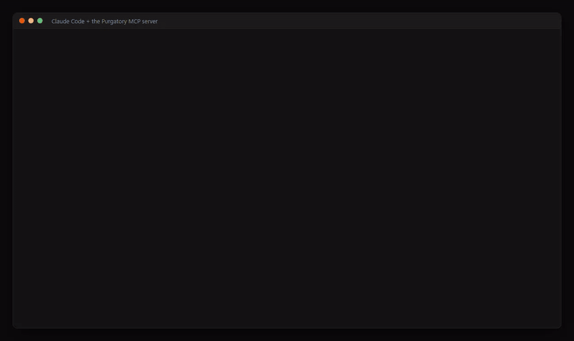

# MCP



The same API is an MCP server at `/mcp` (Streamable HTTP): each endpoint is a tool, such as `list_sandboxes`, `create_sandbox`, `wake_sandbox`, `sleep_sandbox`, `get_sandbox` (with its app links) and `set_sleep_settings`. A tool call runs the endpoint with the caller's token, so it can do exactly what that token can do on the REST API; a token limited to one sandbox stays limited to it, and is offered only the tools it may call (no `create_sandbox`, no token or SSH key management). Only tokens are accepted (not a browser session).

For Claude Code:

```bash
claude mcp add --transport http p7y https://p7y.example.com/mcp --header "Authorization: Bearer p7y_…"
```

Other clients take the same URL and header, e.g. `{"mcpServers": {"p7y": {"type": "http", "url": "https://p7y.example.com/mcp", "headers": {"Authorization": "Bearer p7y_…"}}}}`. Left out: the log stream (it never ends) and the zip export (a file a tool result cannot carry).

Under the hood it is JSON-RPC over HTTP: one `POST /mcp` per call, no session to open first, so even `curl` can call a tool (`tools/list`, then `tools/call` with the tool's `name` and `arguments`):


